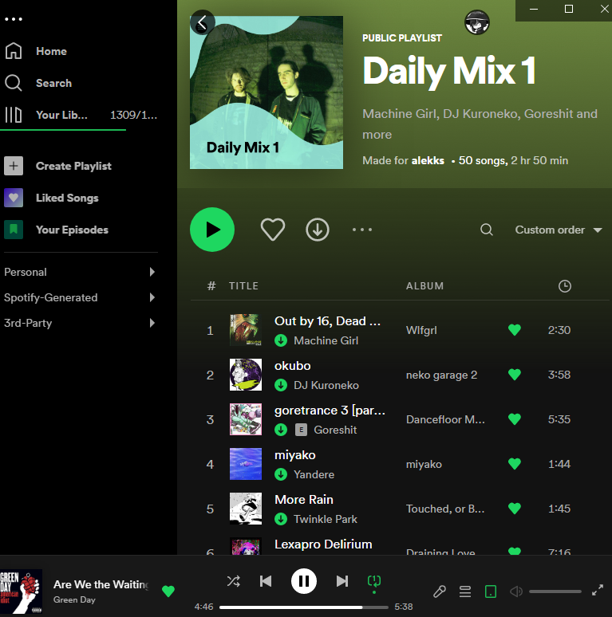
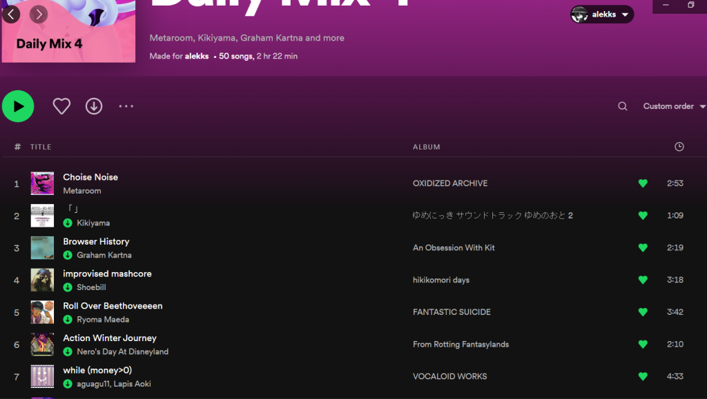

2023-01-15: On Spotify
========================
Well, I haven’t done this for a while, haven’t I?

I think I’ll start doing some sort of more opinion-based blog from now on. I feel like I need something that won’t immediately bore me. Of course, it has to be on topics that I’m comfortable with my mom reading, as she’ll inevitably come barging into my room demanding to see the work that she is forcing onto me. Oh well.

I’m sort of shouting into an empty hall, aren’t I? Goddamn, this is depressing.

My picker wheel selected Spotify as my topic for the day, so I guess I’ll write an opinion on that.

Daily Mixes have gone to absolute shit, and I mean this sincerely. I do not need to see music that I have already listened to, liked, and added to playlists in them. It’s all just old news for me at this point. Take this example:

It’s the same for the rest of the songs in the Daily Mix, and for all the others. Now, these are all good songs – that’s why I liked them and downloaded them. I just think that it’s quite redundant recommending music that I have already listened to many times before. I think that this could be fixed by ensuring that the songs put into these playlists are not on the user’s “Liked Songs.”

You’ll also notice that in this playlist is all of the usual DnB/Breakcore artists – you’ve got your Sewerslvt, your Kuroneko, Goreshit, and Machine Girl to name a few. Then the mix includes Twinkle Park – huh? Last time I checked, Twinkle Park was more of an epunk sort of style band – a good one, but certainly not similar to anything else on the playlist. This is quite confusing, and leads me to my next point – the Daily Mixes are often of the same genre.

Daily Mix 4 is composed of songs largely from the same exact genre as 1. This makes this or 1 redundant – why have Shoebill and strxwberrymilk split into two seperate mixes? That’s just cruel, in my opinion.

TL;DR: Daily Mixes are trash at present and need a rework.

